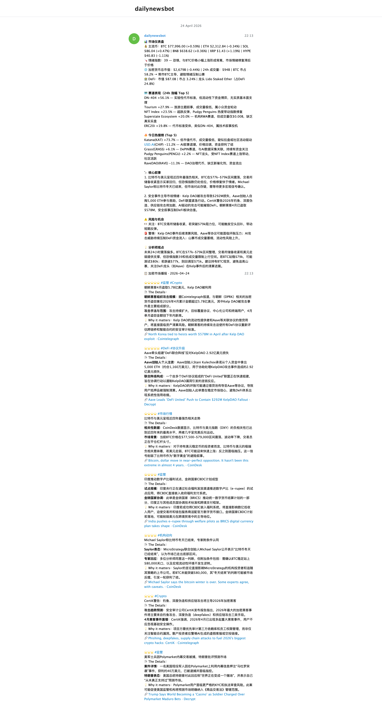

# Crypto Daily Bot

每日自动从 CoinGecko、RSS 等数据源抓取加密市场信息，经 DeepSeek 分析后生成日报，推送到 Telegram。完全自治运行，无需人工干预。

---

## 工作流亮点与数据源支撑

- 🪙 **6 大主流币实时价格**：BTC / ETH / SOL / BNB / XRP / HYPE
  *(API: CoinGecko `/simple/price`)*
- 🔥 **今日热搜榜**：CoinGecko 搜索热度 Top 5，捕捉注意力流向
  *(API: CoinGecko `/search/trending`)*
- 🌐 **加密货币总市值**：总市值 / 24h 成交量 / BTC 市占率 → 牛熊判断
  *(API: CoinGecko `/global`)*
- 🏦 **DeFi 表现**：DeFi 总市值 / 24h 成交量 / DeFi 市占率及龙头
  *(API: CoinGecko `/global/decentralized_finance_defi`)*
- 🗺 **赛道表现 (24h 涨幅 Top 5)**：监控全市场各板块资金流入情况
  *(API: CoinGecko `/coins/categories`)*
- 🌡 **情绪指数**：恐惧贪婪指数实时追踪
  *(API: alternative.me `/fng/`)*
- 📰 **3 大媒体 RSS**：Cointelegraph、CoinDesk、Decrypt
  *(API: Feedparser RSS 聚合)*
- 🤖 **AI 深度分析**：DeepSeek 生成市场晨报 + 新闻播报（共 2 条消息）
- 🔁 **自我修复**：失败时自动重试，持续故障调用 Claude CLI 自动修复代码
- 📦 **消息降级保护**：AI 生成后立即缓存，发送失败下次自动重发

---

## Demo 预览
 
 <details>
 <summary>点击展开查看 Bot 推送到 Telegram 的长图预览</summary>
 <br>
 
 
 
 </details>
 
 ---

## 系统架构与工作流

```
【数据采集层】
CoinGecko /simple/price  ──┐
CoinGecko /search/trending ─┤
CoinGecko /global          ─┼──▶ build_news_context()
alternative.me /fng/       ─┤         │
RSS × 3 源                 ─┘         ▼
                                 call_deepseek() × 2
                                 ┌─── ① PROMPT_ANALYSIS ──▶ 市场晨报
                                 └─── ② PROMPT_NEWS     ──▶ 新闻播报
                                           │
                                           ▼
                                      Telegram（2 条 HTML 消息）

【自动化调度】
08:00  launchd ──▶ crypto_report.py ──▶ run.log [OK/FAIL]
08:30  launchd ──▶ health_check.sh
                        │
                  [OK] ──┴── .ok_streak +1（连续 3 次后清理已解决的 changelog 条目）
                        │
                  [FAIL] ── changelog 新增条目
                        └──▶ auto_repair.sh（后台运行）
                                  ├─ Level 1：等 30s 直接重跑（瞬时网络错误）
                                  └─ Level 2：claude CLI 诊断修复 → 重跑
                                              ├─ 成功 → changelog 标记 [x]
                                              └─ 失败 → macOS 通知，需人工介入
```

---

## 文件结构

```
~/Desktop/bot_ops/shared/bot_utils.py      # 外部共享工具库（与 AI Daily News Bot 共用）
~/Desktop/bot_ops/auto_repair_base.sh     # 外部共享修复逻辑（与 AI Daily News Bot 共用）

Crypto Daily Bot/
├── crypto_report.py                    # 主脚本（抓取 → 分析 → 推送）
├── health_check.sh                     # 健康检查（失败时触发 auto_repair）
├── auto_repair.sh                      # 薄包装：设置参数后委托 bot_ops/auto_repair_base.sh
├── run.log                             # 单行摘要日志（人类可读，脚本运行后生成）
├── run.jsonl                           # 结构化指标日志（程序可读，运行成功后生成）
├── changelog.md                        # 问题追踪，与 health_check 联动
├── pending_messages.json               # Telegram 缓存（仅 Telegram 失败时存在）
├── AGENTS.md                           # 通用 AI 操作手册（适用于任意 AI 工具）
├── CLAUDE.md                           # Claude Code 专属上下文（引用 AGENTS.md）
├── com.shirley.crypto-daily-bot.plist      # launchd 主脚本配置（08:00 触发）
├── com.shirley.crypto-daily-bot-health.plist  # launchd 健康检查配置（08:30 触发）
└── README.md                           # 本文件（人类阅读）
```

> `run.jsonl` 和 `pending_messages.json` 是运行时自动生成的，不会预置在文件夹中。  
> `__pycache__/` 是 Python 自动创建的字节码缓存目录，可安全忽略，建议加入 `.gitignore`。

---

## 环境变量

所有变量已写入 `com.shirley.crypto-daily-bot.plist`，launchd 会自动注入，无需手动配置 shell profile。

| 变量 | 说明 | 来源 |
|------|------|------|
| `DEEPSEEK_API_KEY` | DeepSeek API Key | plist（需手动填入） |
| `TELEGRAM_BOT_TOKEN` | Telegram Bot Token | plist（需手动填入） |
| `TELEGRAM_CHAT_ID` | 目标 Chat ID | plist（已配置）|
| `COINGECKO_API_KEY` | CoinGecko Demo Key | plist（已配置）|
| `HTTPS_PROXY` | 代理地址 | plist（已配置，127.0.0.1:YOUR_PORT）|

---

## 快速开始

**手动运行（测试）**
```bash
cd ~/Desktop/Crypto\ Daily\ Bot
/opt/homebrew/bin/python3.11 crypto_report.py
```

**激活自动调度**

1. 将样板文件拷贝为正式配置文件：
```bash
cp com.shirley.crypto-daily-bot.plist.example com.shirley.crypto-daily-bot.plist
```
2. **重要**：编辑 `com.shirley.crypto-daily-bot.plist`，填入你的 API Key、路径和代理端口。
3. 加载任务：
```bash
cp *.plist ~/Library/LaunchAgents/
launchctl load ~/Library/LaunchAgents/com.shirley.crypto-daily-bot.plist
```

**验证调度状态**
```bash
launchctl list | grep shirley
tail -5 run.log
```

---

## 依赖安装

```bash
pip3.11 install requests feedparser openai
```

---

## 调试

```bash
tail -5 run.log                          # 最近运行状态
tail -3 run.jsonl | python3 -m json.tool # 结构化指标
cat changelog.md                         # 当前问题清单
bash health_check.sh                     # 手动触发健康检查
```

详细操作规范见 [`AGENTS.md`](./AGENTS.md)。
